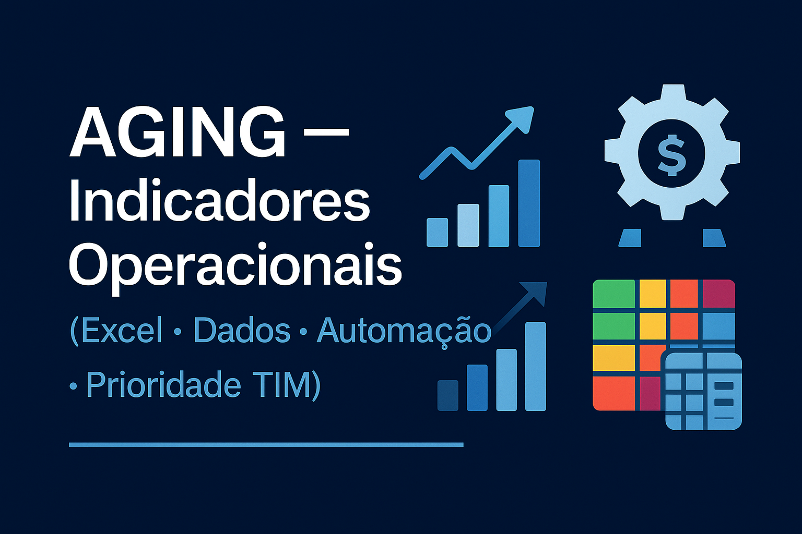

<p align="center">
  
</p>

<p align="center">
  
  
  
  
  
</p>

---

# 📘 Aging — Indicadores Operacionais (Excel + Dados)

Ferramenta criada para apoiar a gestao do Backoffice Operacional (CRC/JEC), trazendo visao clara do Aging,
priorizacao automatica, alertas visuais e calculo da media operacional.

O objetivo e reduzir retrabalho, garantir prazos, melhorar o acompanhamento diario e impactar diretamente
os indicadores de performance (5 estrelas / variavel).

---

# 📌 Indice

- [🎯 Objetivo do Projeto](#-objetivo-do-projeto)
- [🧠 Por Que Este Projeto Existe?](#-por-que-este-projeto-existe)
- [🔄 Fluxo Operacional (Diagrama)](#-fluxo-operacional-diagrama)
- [✨ Principais Funcionalidades](#-principais-funcionalidades)
- [🖼️ Exemplo da Planilha](#️-exemplo-da-planilha)
- [🎨 Regra de Classificacao por Prazo](#-regra-de-classificacao-por-prazo)
- [🛠️ Tecnologias Utilizadas](#️-tecnologias-utilizadas)
- [🚀 Como Usar](#-como-usar)
- [📂 Arquivos no Repositorio](#-arquivos-no-repositorio)
- [📊 Resultados & Beneficios](#-resultados--beneficios)
- [📌 Status do Projeto](#-status-do-projeto)
- [👤 Autor](#-autor)

---

# 🎯 Objetivo do Projeto

- Controlar o Aging com precisao e clareza.  
- Auxiliar no cumprimento dos prazos do JEC/Backoffice.  
- Facilitar priorizacao diaria com dados atualizados.  
- Entregar visao clara da operacao para tomada de decisao.  
- Reduzir erros operacionais e melhorar o desempenho dos indicadores.  

---

# 🧠 Por Que Este Projeto Existe?

A operacao do Backoffice depende diretamente do cumprimento de prazos e da analise diaria do Aging.  
Sem padronizacao, a operacao corre risco de:

- perder prazos  
- aumentar retrabalho  
- elevar risco juridico  
- reduzir performance do 5 estrelas (variavel)  
- perder controle do aging medio  

Este projeto nasce para:

- resolver esse problema  
- padronizar a analise  
- reduzir erros  
- melhorar tomada de decisao  
- entregar velocidade e clareza ao operador e gestor  

---

# 🔄 Fluxo Operacional (Diagrama)

```mermaid
flowchart TB
    A([Recebimento de Casos])
    B([Insercao no Excel])
    C([Classificacao Automatica - Aging])
    D([Identificacao de Risco por Cor])
    E([Analise Operacional])
    F([Atualizacao Diario / SLA])
    G([Resultados e Indicadores])

    A --> B --> C --> D --> E --> F --> G
