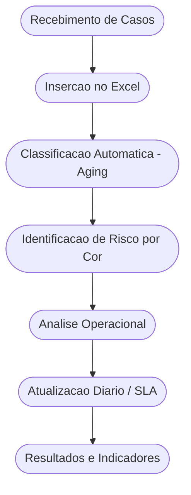

  

## 📦 Download Rápido

➡️ **Clique abaixo para baixar a versão mais recente:**  
📥 [Baixar arquivo (aging-operacional.xlsx)](./aging-operacional.xlsx)

---

  
  
  
  
  

---

# 📘 Aging — Indicadores Operacionais (Excel + Dados)

Ferramenta criada para apoiar a gestao do Backoffice Operacional (CRC/JEC), trazendo visao clara do Aging,
priorizacao automatica, alertas visuais e calculo da media operacional.

O objetivo e reduzir retrabalho, garantir prazos, melhorar o acompanhamento diario e impactar diretamente
os indicadores de performance (5 estrelas / variavel).

---

# 📌 Indice

- [🎯 Objetivo do Projeto](#-objetivo-do-projeto)
- [🧠 Por Que Este Projeto Existe?](#-por-que-este-projeto-existe)
- [🔄 Fluxo Operacional (Diagrama)](#-fluxo-operacional-diagrama)
- [✨ Principais Funcionalidades](#-principais-funcionalidades)
- [🖼️ Exemplo da Planilha](#️-exemplo-da-planilha)
- [🎨 Regra de Classificacao por Prazo](#-regra-de-classificacao-por-prazo)
- [🛠️ Tecnologias Utilizadas](#️-tecnologias-utilizadas)
- [🚀 Como Usar](#-como-usar)
- [📂 Arquivos no Repositorio](#-arquivos-no-repositorio)
- [📊 Resultados & Beneficios](#-resultados--beneficios)
- [📌 Status do Projeto](#-status-do-projeto)
- [👤 Autor](#-autor)

---

# 🎯 Objetivo do Projeto

- Controlar o Aging com precisao e clareza.  
- Auxiliar no cumprimento dos prazos do JEC/Backoffice.  
- Facilitar priorizacao diaria com dados atualizados.  
- Entregar visao clara da operacao para tomada de decisao.  
- Reduzir erros operacionais e melhorar o desempenho dos indicadores.  

---

# 🧠 Por Que Este Projeto Existe?

A operacao do Backoffice depende diretamente do cumprimento de prazos e da analise diaria do Aging.  
Sem padronizacao, a operacao corre risco de:

- perder prazos  
- aumentar retrabalho  
- elevar risco juridico  
- reduzir performance do 5 estrelas (variavel)  
- perder controle do aging medio  

Este projeto nasce para:

- resolver esse problema  
- padronizar a analise  
- reduzir erros  
- melhorar tomada de decisao  
- entregar velocidade e clareza ao operador e gestor  

---

# 🔄 Fluxo Operacional (Diagrama)

<h2 style="color:#4FC3F7">✨ Principais Funcionalidades</h2>

✔ Calculo automatico do Aging (Dias em Aberto)  
✔ Classificacao por prazos com inteligencia condicional  
✔ Destaque visual para prazos criticos  
✔ Legendas integradas (verde, amarelo, laranja, vermelho)  
✔ Calculo da media global da operacao  
✔ Campo de observacoes por caso  
✔ Status por prazo (Dentro, Atencao, Urgente, Vence Hoje, Vencido)  
✔ Layout profissional baseado no branding TIM  

---

# 🖼️ Exemplo da Planilha

*(Adicione o print aqui depois que fizer upload.)*

---

# 🎨 Regra de Classificacao por Prazo

| Faixa            | Dias      | Cor                |
|------------------|-----------|--------------------|
| Dentro do prazo  | 0–3 dias  | 🟢 Verde           |
| Atencao          | 4–5 dias  | 🟡 Amarelo         |
| Urgente          | 6–8 dias  | 🟠 Laranja         |
| Vence hoje       | 9 dias    | 🔴 Vermelho Claro  |
| Vencido          | ≥ 10 dias | 🔴 Vermelho        |

Regras alinhadas ao fluxo JEC/CRC.

---

# 🛠️ Tecnologias Utilizadas

- Excel  
- Formatacao Condicional  
- Funcoes: `SE`, `CONT.SE`, regras personalizadas  
- Layout inspirado no Branding TIM  
- Automatizacao interna por formulas  

---

# 🚀 Como Usar

1. Baixe o arquivo `aging-operacional.xlsx`.  
2. Abra no Excel Desktop.  
3. Preencha a aba **Entrada** com os casos.  
4. A classificacao acontecera automaticamente.  
5. Utilize a cor e o Aging para priorizar o trabalho.  
6. Preencha observacoes conforme necessario.  
7. Utilize para reunioes diarias e acompanhamento de SLA.  

---

# 📂 Arquivos no Repositorio

- `aging-operacional.xlsx` — Planilha principal  
- `readme_assets/` — Imagens utilizadas  
- `README.md` — Documentacao do projeto  

---

# 📊 Resultados & Beneficios

✔ Visão unificada e padronizada da operação  
✔ Redução de erros e retrabalho  
✔ Operação mais previsível  
✔ Impacto direto no indicador 5 Estrelas / Variável  
✔ Melhora na tomada de decisão  
✔ Entregas mais rápidas ao jurídico  
✔ Melhora no controle de aging e SLA  

---
# 🎯 Valor Gerado para a Operação TIM

Este projeto agrega valor direto aos processos operacionais da TIM por meio de:

- 🔹 Organizacão e padronizacao do fluxo operacional  
- 🔹 Reducão de erros na classificacao manual de aging  
- 🔹 Maior previsibilidade e controle dos prazos do JEC/CRC  
- 🔹 Suporte para tomada de decisao mais rapida e assertiva  
- 🔹 Indicadores alinhados ao modelo de performance (5 Estrelas / Variavel)  
- 🔹 Mais transparencia para o operador e para o gestor  
- 🔹 Base estruturada para futuras automacoes (Power BI, Power Automate, IA)  
- 🔹 Melhora real na experiencia operacional e na entrega ao cliente final  

Este painel foi construido com foco na eficiencia, velocidade e clareza — elementos essenciais para a rotina operacional da TIM.

---
# 🛣️ Roadmap (Melhorias Futuras)

- [ ] Criar dashboard no Power BI usando os dados do Aging
- [ ] Adicionar validação de dados automatizada
- [ ] Criar macro para geração automática da legenda
- [ ] Adicionar versão com proteção de células
- [ ] Automação de envio diário (Power Automate)
- [ ] Criar versão integrada com base de dados externa

---

# 📌 Status do Projeto

**Concluido**  
Melhorias visuais e novas funcões poderão ser adicionadas futuramente.

---

# 👤 Autor

**Fabiano Ferreira**  
Transformando operações em processos inteligentes utilizando Dados, BI e Automação.

LinkedIn: https://www.linkedin.com/in/fabiano-ferreira-767100229

  

